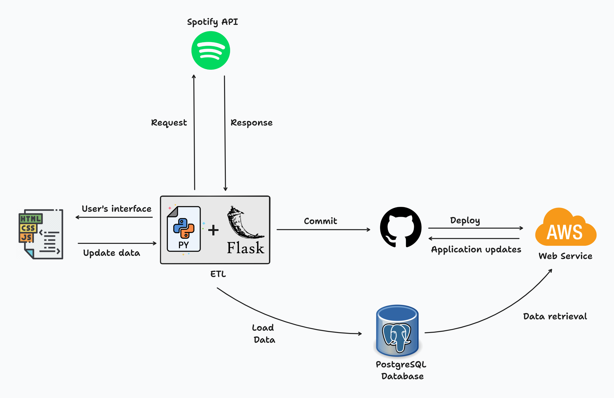
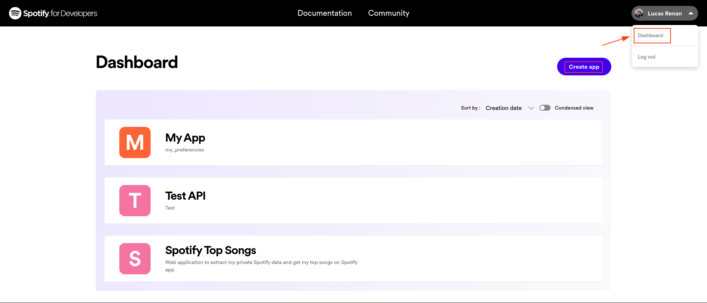
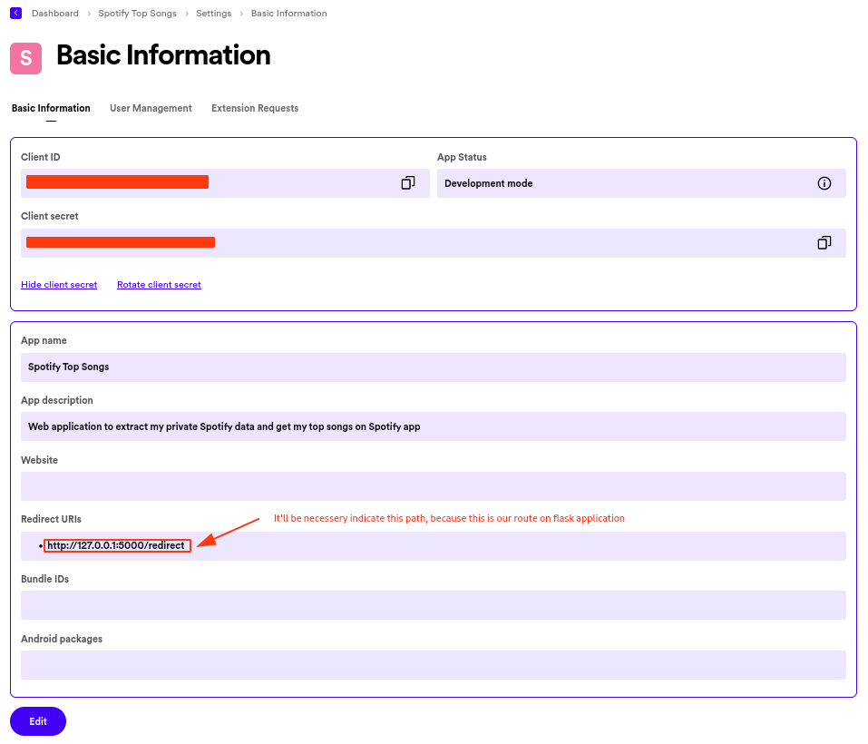

<a name="spotify-profile"></a>

[![Contributors][contributors-shield]][contributors-url]
[![Forks][forks-shield]][forks-url]
[![Stargazers][stars-shield]][stars-url]
[![Issues][issues-shield]][issues-url]
[![MIT License][license-shield]][license-url]
[![LinkedIn][linkedin-shield]][linkedin-url]


<!-- PROJECT LOGO -->
<br />
<div align="center">
  <a href="https://github.com/luk3mn/spotify-profile">
    
  </a>

  <h3 align="center">Spotify Profile</h3>

  <p align="center">
    Web application to extract my private data from Spotify using Spotify API and store in database to display on web application
    <br />
    <a href="https://github.com/luk3mn/spotify-profile/README.md"><strong>Explore the docs »</strong></a>
    <br />
    <br />
  </p>
</div>


<!-- TABLE OF CONTENTS -->
<details>
  <summary>Table of Contents</summary>
  <ol>
    <li>
      <a href="#about-the-project">About The Project</a>
      <ul>
        <li><a href="#built-with">Built With</a></li>
      </ul>
    </li>
    <li>
      <a href="#getting-started">Getting Started</a>
      <ul>
        <li><a href="#prerequisites">Prerequisites</a></li>
        <li><a href="#installation">Installation</a></li>
      </ul>
    </li>
    <li><a href="#usage">Usage</a></li>
    <li><a href="#roadmap">Roadmap</a></li>
    <li><a href="#license">License</a></li>
    <li><a href="#contact">Contact</a></li>
    <li><a href="#acknowledgments">Acknowledgments</a></li>
  </ol>
</details>


<!-- ABOUT THE PROJECT -->
## About The Project



<p align="justify">
  Web Applications built in Python and Flask to implement an ETL pipeline to extract Spotify private data via API and load it on the database. This project will allow Flask to request my private data from Spotify API and structure them using pandas to load in a Postgres database, and a little bit further, retrieve these data in a Front-End application built in HTML5, CSS3, and Javascript, and on top of that, it was necessary to use jinja2 from Flask to allow using templates on front-end application. 

  In this project, it was necessary to split it into three parts, such as: 
  - **ETL Pipeline:** to extract and load these on the database;
  - **Front-End Application:** User’s interface to be able to showcase these private data in a web application;
  - **Deploy:** The last part was deployment from a web application using GitHub and cloud AWS by Render Deployment to create a CI/CI workflow to allow new releases on the web application;
</p> 

### Utils Module
> Authorization

Allow Flask to use some Spotify permission to connect the web application to Spotify API.

- **Get Access Token:** It will be to send a type 'post' request with some params for API and get a response with an access token:
  - TYPE: "grant_type"
  - AUTHORIZATION CODE: "code"
  - APP REDIRECT URI: "redirect_uri"
  - SPOTIFY CLIENT ID: 'client_id'
  - SPOTIFY CLIENT SECRET: 'client_secret'

_NOTE: we can get these params on Spotify documentation_

> Get Data: 

This module can get our data from Spotify API as a JSON response and pass them for data format. In that way, we could use some API endpoint from Spotify to request these data, such as:
Get Uer’s Top Items: include Tracks and Artists
Get User’s Profile
Get Current User’s Playlist
Get Recently Played Tracks
Search For Items
> Data Format

We can use it to structure every data extracted using pandas, in other words, part of the transformation data happens here because we need to structure these data before loading them on the database.
It will be returned to a Pandas DataFrame
Store these data formatted on the database using SQLAlchemy function “to_sql”.


### Loading data
It comes after extracting and formatting target data, and then, it’ll be possible to come up with a way to ingest structured data into the database. To be able to ingest these data, it was necessary to use the SQLAlchemy library from Python and the function “to_sql” to convert Pandas DataFrame to SQL syntax.

In the first place, data ingestion was used on an SQLite database, to be able to store simple data, but, a little bit further, it was important to create a Postgres Database using docker as a test local database, before shifting to a production database working on cloud.

### Front-End Application
This part of the application was built using HTML5, CSS3, and Javascript to interact with jinja2 from Flask to data retrieval from database to interface application. On top of that, the application interface was split into three views to explore many endpoint features from API and so on.

Each of these views requests data from the Postgres database using jinja2 templates which interact with front-end stacks to render some pieces of information in the application interface.

After building the first view from the web application, it used Github to create a CI/CD process to allow web service working on the cloud to request new updates from the web application every time the new adust is detected. 

It’s important to say, that there exists an option in profile visualization to request new data for Spotify API to be able to update the database with new information, but it’s just can be used by a logged account from Spotify that is requesting these data.

<p align="right">(<a href="#spotify-profile">back to top</a>)</p>


### Built With

Write here

* [![Python][Python]][Python-url]
* [![Flask][Flask]][Flask-url]
* [![Pandas][Pandas]][Pandas-url]
* [![PostgreSQL][PostgreSQL]][PostgreSQL-url]
* [![Spotify][Spotify]][Spotify-url]
* [![Javascript][Javascript]][Javascript-url]

<p align="right">(<a href="#spotify-profile">back to top</a>)</p>


<!-- GETTING STARTED -->
## Getting Started

Here are some important topics about this project and how to replay it.

### Prerequisites

* virtualenv
  ```sh
  python3 -m venv .venv
  ```

### Installation

_Before starting this application in your local environment, it'll be necessary to proceed with some tasks to reproduce this project._

1. Get API Access [https://developer.spotify.com](https://developer.spotify.com/documentation/web-api)
2. Clone the repo
   ```sh
   git clone https://github.com/luk3mn/spotify-profile.git
   ```
3. Install packages
   ```sh
   pip freeze -r requirements.txt
   ```

<p align="right">(<a href="#spotify-profile">back to top</a>)</p>


<!-- USAGE EXAMPLES -->
## Usage

1. Create a new app on Spotify API after logging on your spotify account


2. Get both access credentials, "CLIENT_ID" and "CLIENT_SECRET" and indicate your redirect path of the application


**OBS: This path it'll be necessary to extract our data from Spotify, we can specify it after building our flask application.**

_For more explanations, please refer to the [Documentation](https://developer.spotify.com/documentation/web-api/tutorials/getting-started)_

<p align="right">(<a href="#spotify-profile">back to top</a>)</p>

> Useful Queries: Can be useful to personalize these queries to showcase some information in better or different ways.

- Select to allow showcase of these data groups by the number of times that the same track was played:
```
query = db.session.execute(text("""
    SELECT  name,
            artist,
            album,
            popularity,
            spotify_url,
            preview_url,
            album_url,
            release,
            image,
            count(track_id) as "played"
    from tb_recently_played
    GROUP BY name, album, artist, release, image, popularity, spotify_url, preview_url, album_url
    ORDER BY played DESC
""")).all()
```

- Select the most played track among all in the same list:
```
query = db.session.execute(text("""
    SELECT * FROM (
        SELECT  name, 
                image, 
                artist, 
                album, 
                release, 
                popularity, 
                spotify_url,
                count(track_id) as "played"
        FROM tb_recently_played
        GROUP BY name, image, track_id, artist, album, release, popularity, spotify_url
        ORDER BY played DESC
    ) AS "most_played"
    WHERE played = (
        SELECT max(played) FROM (
            SELECT count(track_id) as "played"
            FROM tb_recently_played
            GROUP BY track_id
        ) AS "max_played"
    )
""")).all()
```

- Select the latest played track based on the time that this song was played:
```
query = db.session.execute(text("""
    SELECT * FROM tb_recently_played
    WHERE played_at = (
        SELECT max(played_at)
        FROM tb_recently_played
    )
""")).all()
```

<!-- ROADMAP -->
## Roadmap

- [x] Pipeline ETL using Spotify private data
  - [x] Data Extract: _Get data using Spotify API_
  - [x] Data Transform: _Transform these data in structure data using pandas_
  - [x] Data Load: _Store these data on database to retrieve on web application using SQL Alchemy_
- [ ] Web application
  - [x] Profile
    - [x] Get User's Profile
    - [x] Get User's Top Artists
    - [x] Spotify Playlist
  - [x] Tracks
    - [x] Get User's Top Tracks
  - [x] Discover
    - [x] Get Recently Played Tracks
    - [x] Discover Weekly
    - [x] Latest Played Track
    - [x] Most Played Track
    - [x] Recommendations

<p align="right">(<a href="#spotify-profile">back to top</a>)</p>


<!-- LICENSE -->
## License

Distributed under the MIT License. See `LICENSE.txt` for more information.

<p align="right">(<a href="#spotify-profile">back to top</a>)</p>


<!-- CONTACT -->
## Contact

Lucas Renan - lucasnunes2030@gmail.com

Project Link: [https://github.com/luk3mn/spotify-profile](https://github.com/luk3mn/spotify-profile)

<p align="right">(<a href="#spotify-profile">back to top</a>)</p>


<!-- ACKNOWLEDGMENTS -->
## Acknowledgments

I think it would be interesting to sit here some references and other resources that were really useful and helped me to come up with this project.
* [Data Engineering Course for Beginners - #1 EXTRACT](https://www.youtube.com/watch?v=dvviIUKwH7o)
* [Data Engineering Course For Beginners - #2 TRANSFORM](https://www.youtube.com/watch?si=4eZ8d_WhtkNkS12o&v=X-phMpEp6Gs&feature=youtu.be)
* [Data Engineering Course For Beginners - #3 LOAD](https://www.youtube.com/watch?v=rvPtpOjzVTQ)
* [Scrape Spotify’s API within 20 mins](https://alpargur.medium.com/scrape-spotifys-api-in-within-20-mins-611885897851)
* [Spotify OAuth: Automating Discover Weekly Playlist - Full Tutorial](https://www.youtube.com/watch?v=mBycigbJQzA)
* [Bored of Libraries? Here’s How to Connect to the Spotify API Using Pure Python](https://python.plainenglish.io/bored-of-libraries-heres-how-to-connect-to-the-spotify-api-using-pure-python-bd31e9e3d88a)
* [Spotify API OAuth - Automate Getting User Playlists (Complete Tutorial)](https://www.youtube.com/watch?v=olY_2MW4Eik)
* [Python: Loop through JSON File](https://stackoverflow.com/questions/41445573/python-loop-through-json-file)
* [How to Solve: Insufficient client scope in Python using Spotipy](https://stackoverflow.com/questions/56173066/how-to-solve-insufficient-client-scope-in-python-using-spotipy)
* [How to Use Flask-SQLAlchemy to Interact with Databases in a Flask Application](https://www.digitalocean.com/community/tutorials/how-to-use-flask-sqlalchemy-to-interact-with-databases-in-a-flask-application)
* [Introduction to SQLAlchemy in Pandas Dataframe](https://www.sqlshack.com/introduction-to-sqlalchemy-in-pandas-dataframe/)
* [Best-README-Template](https://github.com/othneildrew/Best-README-Template)

<p align="right">(<a href="#spotify-profile">back to top</a>)</p>


<!-- MARKDOWN LINKS & IMAGES -->
<!-- https://www.markdownguide.org/basic-syntax/#reference-style-links -->
[contributors-shield]: https://img.shields.io/github/contributors/luk3mn/spotify-profile.svg?style=for-the-badge
[contributors-url]: https://github.com/luk3mn/spotify-profile/graphs/contributors
[issues-shield]: https://img.shields.io/github/issues/luk3mn/spotify-profile.svg?style=for-the-badge
[issues-url]: https://github.com/luk3mn/spotify-profile/issues
[forks-shield]: https://img.shields.io/github/forks/luk3mn/spotify-profile.svg?style=for-the-badge
[forks-url]: https://github.com/luk3mn/spotify-profile/network/members
[stars-shield]: https://img.shields.io/github/stars/luk3mn/spotify-profile.svg?style=for-the-badge
[stars-url]: https://github.com/luk3mn/spotify-profile/stargazers
[license-shield]: https://img.shields.io/github/license/othneildrew/Best-README-Template.svg?style=for-the-badge
[license-url]: https://github.com/luk3mn/spotify-profile/blob/master/LICENSE
[linkedin-shield]: https://img.shields.io/badge/-LinkedIn-black.svg?style=for-the-badge&logo=linkedin&colorB=555
[linkedin-url]: https://www.linkedin.com/in/lucasmaues/
[general-code-screenshot]: assets/general-project.png

<!-- Stack Shields -->
[Python]: https://img.shields.io/badge/Python-3776AB?style=for-the-badge&logo=python&logoColor=ffffff
[Python-url]: https://www.python.org/
[Flask]: https://img.shields.io/badge/Flask-000000?style=for-the-badge&logo=flask&logoColor=ffffff
[Flask-url]: https://flask.palletsprojects.com/en/3.0.x/
[Pandas]: https://img.shields.io/badge/Pandas-150458?style=for-the-badge&logo=pandas&logoColor=ffffff
[Pandas-url]: https://pandas.pydata.org/
[PostgreSQL]: https://img.shields.io/badge/POSTGRESQL-4169E1?style=for-the-badge&logo=postgresql&logoColor=ffffff
[PostgreSQL-url]: https://www.postgresql.org/
[Spotify]: https://img.shields.io/badge/Spotify%20API-1DB954?style=for-the-badge&logo=spotify&logoColor=ffffff
[Spotify-url]: https://developer.spotify.com/documentation/web-api
[Javascript]: https://img.shields.io/badge/Javascript-yellow?style=for-the-badge&logo=javascript&logoColor=ffffff
[Javascript-url]: https://developer.mozilla.org/pt-BR/docs/Web/JavaScript